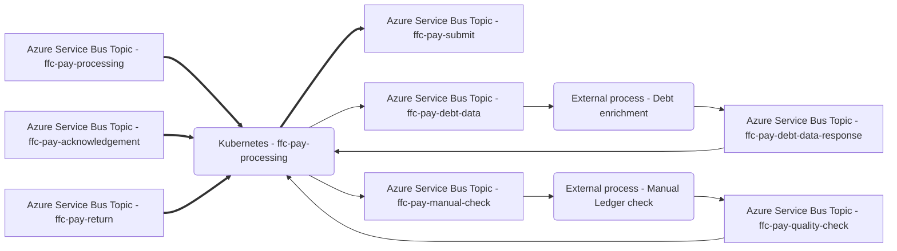

# Pay Processing

Microservice to process payment requests including post payment adjustment calculation, ledger assignment and invoice splitting.

This service is part of the [Strategic Payment Service](https://github.com/DEFRA/ffc-pay-core).



## Prerequisites
### Software required
- [Azure Service Bus](https://docs.microsoft.com/en-us/azure/service-bus-messaging/)
- [Docker](https://www.docker.com/)
- Either:
  - [Docker Compose](https://docs.docker.com/compose/install/linux/#install-the-plugin-manually)
  - [Docker-Compose (standalone)](https://docs.docker.com/compose/install/other/)

Optional:
- [Kubernetes](https://kubernetes.io/)
- [Helm](https://helm.sh/)

### Configuration
#### Azure Service Bus

This service publishes responses as messages to Azure Service Bus topics.

| Name | Description |
| ---| --- |
| `MESSAGE_QUEUE_HOST` | Azure Service Bus hostname, e.g. `myservicebus.servicebus.windows.net` |
| `MESSAGE_QUEUE_USER` | Azure Service Bus SAS policy name, e.g. `RootManageSharedAccessKey` |
| `MESSAGE_QUEUE_PASSWORD` | Azure Service Bus SAS policy key |
| `MESSAGE_QUEUE_SUFFIX` | Developer initials, optional, will be automatically added to topic names, e.g. `-jw` |
| `ACKNOWLEDGEMENT_TOPIC_ADDRESS` | Azure Service Bus topic name for acknowledgement messages, e.g. `ffc-pay-acknowledgement` |
| `ACKNOWLEDGEMENT_SUBSCRIPTION_ADDRESS` | Azure Service Bus subscription name for `ACKNOWLEDGEMENT_TOPIC_ADDRESS` |
| `RETURN_TOPIC_ADDRESS` | Azure Service Bus topic name for payment settlements, e.g. `ffc-pay-return` |
| `RETURN_SUBSCRIPTION_ADDRESS` | Azure Service Bus subscription for `RETURN_TOPIC_ADDRESS` |
| `PROCESSING_TOPIC_ADDRESS` | Azure Service Bus topic name for payment requests messages, e.g. `ffc-pay-processing` |
| `PROCESSING_SUBSCRIPTION_ADDRESS` | Azure Service Bus subscription for `PROCESSING_TOPIC_ADDRESS` |
| `SUBMIT_TOPIC_ADDRESS` | Azure Service Bus topic name for completed payment requests, e.g. `ffc-pay-submit` |
| `DEBT_TOPIC_ADDRESS` | Azure Service Bus topic name for debt data requests, e.g. `ffc-pay-debt-data` |
| `QC_TOPIC_ADDRESS` | Azure Service Bus topic name for debt data responses, e.g. `ffc-pay-debt-data-response` |
| `QC_SUBSCRIPTION_ADDRESS` | Azure Service Bus subscription for `QC_TOPIC_ADDRESS` |
| `MANUAL_CHECK_TOPIC_ADDRESS` | Azure Service Bus topic name for manual ledger check requests, e.g. `ffc-pay-manual-check` |
| `QC_MANUAL_CHECK_TOPIC_ADDRESS` | Azure Service Bus topic name for manual ledger check responses, e.g. `ffc-pay-quality-check` |
| `QC_MANUAL_CHECK_SUBSCRIPTION_ADDRESS` | Azure Service Bus subscription for `QC_MANUAL_CHECK_TOPIC_ADDRESS` |

##### Message schemas

All message schemas are fully documented in an [AsyncAPI specification](docs/asyncapi.yaml).


## Setup
### Configuration

These configuration values should be set in the [docker-compose.yaml](docker-compose.yaml) file 
or Helm [values file](./helm/ffc-pay-responses/values.yaml) if running Kubernetes.

| Name | Description |
| ---| --- |
| `APPINSIGHTS_CLOUDROLE` | Azure App Insights cloud role |
| `APPINSIGHTS_INSTRUMENTATIONKEY` | Azure App Insights instrumentation key |
| `PROCESSING_INTERVAL` | Interval in milliseconds for how often payment processing of pending payment requests, e.g. `5000` |
| `PROCESSING_CAP` | Maximum number of payment requests to process per interval, e.g. `500` |
| `USE_MANUAL_LEDGER_CHECK` | Enable manual ledger checking, if `true` all calculated ledger assignments will be routed to `MANUAL_LEDGER_CHECK` topic for confirmation/amendment before submission |
| `AUTO_HOLD_TOP_UP` | Enable automatic holding of top-up payments, if `true` all top-up payments will not be released |
| `AUTO_HOLD_RECOVERY` | Enable automatic holding of recoveries and downward adjustments, if `true` all recoveries will not be released |

### Docker

Docker Compose can be used to build the container image.  

```
docker-compose build
```

The service will file watch application and test files so no need to rebuild the container unless a change to an npm package is made.

## How to start the service

The service can be run using the [start](./scripts/start) script.

```
./scripts/start
```

This script accepts any Docker Compose [Up](https://docs.docker.com/engine/reference/commandline/compose_up/) argument.

### Debugging

A debugger can be attached to the running application using port `9244`.

## How to get an output

This service calculates the final state of a payment request, thereby ensuring that the correct activities are performed by DAX.

The output of this service will vary depending not only the payment request being processed, but also the payment history of that request.

The following examples will reference message schemas defined in the [AsyncAPI specification](docs/asyncapi.yaml).

### First payments

First payments are where no previous payment exists for the `FRN`, `agreementNumber` and `marketingYear` combination.  The `paymentRequestNumber` value will be set at `1`.

Message schema: `ffc-pay-processing`
Service Bus Topic: `ffc-pay-processing`

As no payment history exists, the expectation is that the payment request will be immediately published to the `SUBMIT_TOPIC_ADDRESS` topic targetting the `AP` ledger.

### Post Payment Adjustments

Post payment adjustments are where a previous version of the payment request exists for the `FRN`, `agreementNumber` and `marketingYear` combination.  The `paymentRequestNumber` value will be set at `2` or above.

Message schema: `ffc-pay-processing`
Service Bus Topic: `ffc-pay-processing`

The payment request will be compared to all previous versions of the payment request at invoice line level.  A "delta" value will be calculated for each invoice line.  The sum of these delta values will equal the updated `value` of the payment request.

#### Top up

Top up payments are where the `value` is greater than the total paid for all previous payment requests.

The expectation is that the payment request will be immediately published to the `SUBMIT_TOPIC_ADDRESS` topic targetting the `AP` ledger.
The `value` will be updated to the `value` minus the total paid for all previous payment requests.

#### Downward adjustments

Downward adjustments are where the `value` is less than the total paid for all previous payment requests.  However, there is sufficient balance in the `AP` ledger to cover the adjustment.

The expectation is that the payment request will be immediately published to the `SUBMIT_TOPIC_ADDRESS` topic targetting the `AP` ledger.
The `value` will be updated to the `value` minus the total paid for all previous payment requests. ie. the `value` will be negative.

#### Recoveries

Recoveries are where the `value` is less than the total paid for all previous payment requests.  However, there is insufficient balance in the `AP` ledger to cover the adjustment.

If the `AP` ledger balance is `0`, the expectation is that the payment request will be immediately published to the `SUBMIT_TOPIC_ADDRESS` topic targetting the `AR` ledger.
The `value` will be updated to the `value` minus the total paid for all previous payment requests. ie. the `value` will be negative.

> Note: Payment requests originating from Siti Agri do not contain enough information to raise a debt on the AR ledger.
> The payment request will be published to the `DEBT_TOPIC_ADDRESS` topic for enrichment of debt data.
> Once enriched, the data will be published to the `QC_TOPIC_ADDRESS` topic.
> The post payment adjustment calculation will be repeated to ensure it is based on the latest ledger position.

If the `AP` ledger balance is greater than `0`, the expectation is that the payment request will split into two payment requests.
One offsetting the `AP` ledger balance and the other raising the remainder a debt the `AR` ledger balance.

#### Net zero

Net zero payments are where the `value` is equal to the total paid for all previous payment requests so the adjustment value is `0`.

DAX does not support loading of `0` value payment requests, however there may be upward and downward adjustment of individual invoice lines that need to be reflected in downstream accounting.

The expectation is that the payment request will be split into two payment requests published to the `SUBMIT_TOPIC_ADDRESS` topic both targetting the `AP` ledger.
One with all positive invoice lines and the other with all negative invoice lines.

#### Top up following downward adjustment and/or recovery

Because both the `AP` and `AR` ledgers may have previously been used in this scenario, then we may not necessarily just forward the delta value to `AP`.

If all previous requests were first payments top ups or downward adjustments, the behaviour is the same as a top up described above.

If any payment request has been a recovery, then the top up can be used to offset the debt.

If the `value` is less than the total debt raised on the `AR` ledger for all previous payment requests, the expectation is that the payment request will be immediately published to the `SUBMIT_TOPIC_ADDRESS` topic targetting the `AR` ledger.

If the `value` is greater than the total debt raised on the `AR` ledger for all previous payment requests, the expectation is that the payment request will be split into two payment requests published to the `SUBMIT_TOPIC_ADDRESS` topic.  Once cancelling out the debt targetting the `AR` ledger and the other raising the remainder as a top up targetting the `AP` ledger.

### Manual ledger checking

If the `USE_MANUAL_LEDGER_CHECK` environment variable is set to `true`, then all calculated ledger assignments will be routed to the `MANUAL_LEDGER_CHECK` topic for confirmation/amendment before submission.

This applies only to the following post payment adjustment scenarios:
- Downward adjustment
- Recovery
- Top up following downward adjustment and/or recovery

Once the ledger assignment has been confirmed, the payment request will be published to the `SUBMIT_TOPIC_ADDRESS` topic.

### Payment holds

A payment hold can be applied to a customer by `FRN` and `SchemeId`.  This will pause processing of any matching payment request until the hold is removed.

A REST API is exposed to support the adding and removing of payment holds.

API documented in the [Open API specification](docs/openapi.yaml).

Hold categories are persisted in PostgreSQL database and are managed through Liquibase migrations.  Hold categories are agreed with the business and are not managed through the API.

### Scheme holds

A full scheme hold can be applied by `SchemeId`.  This will pause processing of any matching payment request until the hold is removed.

A REST API is exposed to support the adding and removing of scheme holds.

API documented in the [Open API specification](docs/openapi.yaml).

### Reset payment request

A payment request can be "reset" to be reprocessed by `invoiceNumber`.

The expected use case is where DAX has been unable to process a payment request due to a temporary error but is unable to recover the request sent.
Therefore, the only way to complete the transaction is to resend the request.

A REST API is exposed to support the resetting of payment requests.

API documented in the [Open API specification](docs/openapi.yaml).

There are scenarios where this is automated, see `Acknowledgements` below.

### Acknowledgements

Message schema: `ffc-pay-acknowledgement`
Service Bus Topic: `ffc-pay-acknowledgement`

An acknowledgement will be published to the `ACKNOWLEDGEMENT_TOPIC_ADDRESS` topic for each payment request received by DAX.

If the request was successful then no further action will be expected.

If the request was unsuccessful, then the payment request will automatically have a hold applied for that `FRN` and `SchemeId` combination.
The payment will automatically be reset for reprocessing.  Once the hold is removed the payment request will be released.

There is a common scenario where if a customer does not have a valid bank account setup in DAX, the request will be rejected.
For that scenario the hold category will be `Invalid Bank Details`.

For all other failures, the hold category will be `DAX Rejection`.

### Settlements

Message schema: `ffc-pay-return`
Service Bus Topic: `ffc-pay-return`

A settlement will be published to the `RETURN_TOPIC_ADDRESS` topic for each settlement made by DAX on the `AP` ledger.

The settlement will include the cumulative total value settled against the payment request.

No output is expected, however the data will be used to support ledger assignment for future post payment adjustments.

## How to stop the service

The service can be stopped using the [stop](./scripts/stop) script.

```
./scripts/stop
```

The script accepts any Docker Compose [Down](https://docs.docker.com/engine/reference/commandline/compose_down/) argument.

For example, to stop the service and clear all data volumes.

```
./scripts/stop -v
```

## How to test the service

The service can be tested using the [test](./scripts/test) script.

```
./scripts/test
```

The script accepts the following arguments:

- `--watch/-w` - run tests with file watching to support Test Driven Development scenarios (TDD)
- `--debug/-d` - run tests in debug mode.  Same as watch mode but will wait for a debugger to be attached before running tests.

## CI pipeline

This service uses the [FFC CI pipeline](https://github.com/DEFRA/ffc-jenkins-pipeline-library)

## Licence

THIS INFORMATION IS LICENSED UNDER THE CONDITIONS OF THE OPEN GOVERNMENT LICENCE found at:

<http://www.nationalarchives.gov.uk/doc/open-government-licence/version/3>

The following attribution statement MUST be cited in your products and applications when using this information.

> Contains public sector information licensed under the Open Government license v3

### About the licence

The Open Government Licence (OGL) was developed by the Controller of Her Majesty's Stationery Office (HMSO) to enable information providers in the public sector to license the use and re-use of their information under a common open licence.

It is designed to encourage use and re-use of information freely and flexibly, with only a few conditions.
